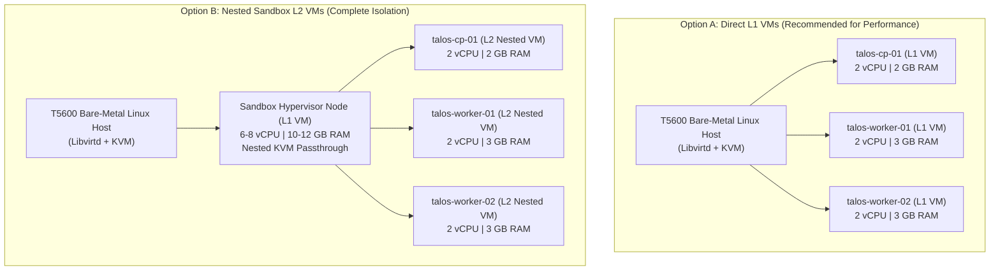
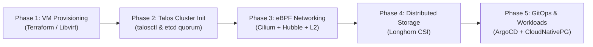

# Architecture Blueprint & Implementation Plan: Advanced Kubernetes Platform on Nested Libvirt / Talos Linux

## Goal Description
Build an enterprise-grade, multi-node Kubernetes platform from the ground up using **Talos Linux** (immutable, API-driven Kubernetes OS), **Cilium eBPF CNI**, **Cloud-Native Storage (Longhorn)**, and **ArgoCD GitOps**. 

This project demonstrates deep Kubernetes fundamentals (etcd management, control plane vs. worker scheduling, pod topology spread, network policies, dynamic persistent storage) and modern cloud-native platform engineering.

---

## Architecture Topologies: Physical vs. Nested Sandbox

You have two clean options for hosting this on your Dell Precision T5600:



> [!NOTE]
> **Option A (Direct L1 VMs)** provides near bare-metal speed and simplifies storage I/O.
> **Option B (Nested Sandbox L2 VMs)** matches your existing `01-nested-sandbox` stage, encapsulating the entire lab inside a single destroyable VM without polluting the host hypervisor. Both are supported by the Terraform modules.

---

## User Review Required

> [!IMPORTANT]
> **1. OS Selection:** Talos Linux vs. Ubuntu + Kubeadm. We recommend **Talos Linux** because it is purpose-built for Kubernetes, eliminates SSH/systemd security anti-patterns, and uses 100% declarative YAML for OS and cluster configurations.
> **2. Virtualization Level:** Confirm if you want to deploy the nodes as L1 VMs directly on the T5600, or inside a dedicated L1 Sandbox VM (Nested L2).

---

## Target Technology Stack

| Layer | Technology | Key Capabilities & Learning Highlights |
| :--- | :--- | :--- |
| **Infrastructure / OS** | **Talos Linux + Libvirt/QEMU** | Declarative machine config, zero SSH attack surface, immutable rootfs, `talosctl` mTLS API. |
| **Container Runtime & K8s** | **containerd + Upstream K8s v1.31+** | Native upstream control plane (`kube-apiserver`, `etcd`, `kube-controller-manager`, `kube-scheduler`). |
| **Networking & Security** | **Cilium CNI (eBPF)** | `kube-proxy` replacement, Layer 2 IP Announcement (LoadBalancer without MetalLB), Hubble flow visualizer, CiliumNetworkPolicies. |
| **Dynamic Storage (CSI)** | **Longhorn CSI** | Distributed block storage across workers, VolumeSnapshots, dynamic StorageClasses, ReadWriteOnce & ReadWriteMany volumes. |
| **Secrets Management** | **External Secrets Operator (ESO)** | Decouples secrets from Git; syncs with HashiCorp Vault or native K8s secure stores. |
| **Continuous Delivery** | **ArgoCD (GitOps)** | Root App-of-Apps pattern, automated synchronization, drift detection, and declarative cluster add-ons. |
| **Sample Workload** | **CloudNativePG + Multi-tier App** | HA PostgreSQL cluster with automated failover, distributed stateful pods, pod anti-affinity, and Gateway API routing. |

---

## Proposed Project Structure

```
talos-homelab-k8s/
├── Makefile                            # Top-level workflow automation
├── terraform/
│   ├── modules/
│   │   ├── libvirt_talos_node/         # Reusable libvirt VM module for Talos
│   │   └── talos_cluster/              # Talos machine configs & bootstrap provider
│   └── environments/
│       ├── 01-nested-sandbox/          # (Optional) L1 Sandbox VM if running nested
│       └── 02-talos-cluster/           # L1/L2 Talos Control Plane & Worker VMs
├── talos/
│   ├── talconfig.yaml                  # Declarative Talos cluster generator (talhelper)
│   ├── patches/                        # Machine config patches (Cilium prerequisites, storage disks)
│   └── talosconfig                     # Generated mTLS client config
├── gitops/
│   ├── bootstrap/
│   │   └── root-application.yaml       # ArgoCD Root App-of-Apps
│   ├── platform/
│   │   ├── cilium/                     # Helm values for Cilium CNI + Hubble + L2 Announcement
│   │   ├── longhorn/                   # StorageClass & CSI provisioner
│   │   ├── cert-manager/               # TLS certificate automation
│   │   └── external-secrets/           # Secret synchronization operator
│   └── apps/
│       └── production/
│           └── cloudnative-pg/         # HA Postgres database cluster & sample app
└── docs/
    ├── 01-architecture.md
    ├── 02-bootstrap-guide.md
    └── 03-disaster-recovery-drills.md
```

---

## Phased Implementation Roadmap



### Phase 1: Virtual Infrastructure & Talos Images
1. Create Terraform module for Talos VMs on libvirt attaching to `virbr0` (NAT) or `br0` (Bridged).
2. Download and register the official Talos KVM image (`nocloud-amd64.raw.zst` or `qcow2`).
3. Define 1 Control Plane VM (`talos-cp-01`: 2 vCPU, 2GB RAM, 20GB OS disk) and 2 Worker VMs (`talos-worker-01`, `talos-worker-02`: 2 vCPU, 3GB RAM, 20GB OS disk + 30GB unformatted data disk for Longhorn storage).

### Phase 2: Cluster Generation & Bootstrapping
1. Generate machine configurations with `talosctl gen config` with `kube-proxy` disabled (in preparation for Cilium).
2. Apply machine configs via `talosctl apply-config` over mTLS to control plane and worker IP addresses.
3. Bootstrap etcd via `talosctl bootstrap --nodes <cp-ip>`.
4. Fetch admin `kubeconfig` and verify node registration (`kubectl get nodes`).

### Phase 3: Cilium eBPF Networking & Hubble
1. Deploy Cilium via Helm with:
   - `kubeProxyReplacement: true`
   - `k8sServiceHost` and `k8sServicePort` pointing to the Talos control plane endpoint.
   - `l2announcements.enabled: true` for virtual IP / LoadBalancer hosting.
   - Hubble metrics & UI enabled.
2. Verify cross-node pod connectivity and network policy enforcement.

### Phase 4: Longhorn Distributed Block Storage
1. Deploy Longhorn CSI via Helm/GitOps utilizing the secondary attached virtual disks (`/dev/vdb`).
2. Validate dynamic PVC provisioning, volume replication across both worker nodes, and snapshot capabilities.

### Phase 5: GitOps (ArgoCD) & Stateful Workload Demonstration
1. Install ArgoCD and link to repository root.
2. Deploy **CloudNativePG** (High-Availability Postgres operator) to demonstrate:
   - Stateful workload orchestration with automated failover.
   - Anti-affinity rules preventing replicas from co-locating on the same physical worker VM.
   - Automatic volume expansion and backup snapshots to S3/MinIO.

---

## Verification Plan

### Automated Checks
* `talosctl health --nodes <cp-ip>` - Verifies etcd health, apiserver status, and kubelet readiness.
* `cilium status --wait` & `cilium connectivity test` - Runs 40+ automated network validation tests (DNS, Pod-to-Pod, Pod-to-Service, egress, NetworkPolicies).
* `kubectl get storageclass,pvc,pods -A` - Verifies all system and CSI pods are in `Running` state and StorageClasses are `Ready`.

### Hands-On Failure Injection & Learning Scenarios
* **Node Eviction & Maintenance Drill:** Execute `kubectl cordon` + `kubectl drain` on `talos-worker-01`, verifying zero downtime on stateful app replicas.
* **Network Flow Auditing:** Open Hubble UI and inspect live eBPF socket tracing for all ingress and egress flows.
* **Volume Snapshot & Restore:** Simulate data corruption in Postgres and restore directly from a CSI VolumeSnapshot.
