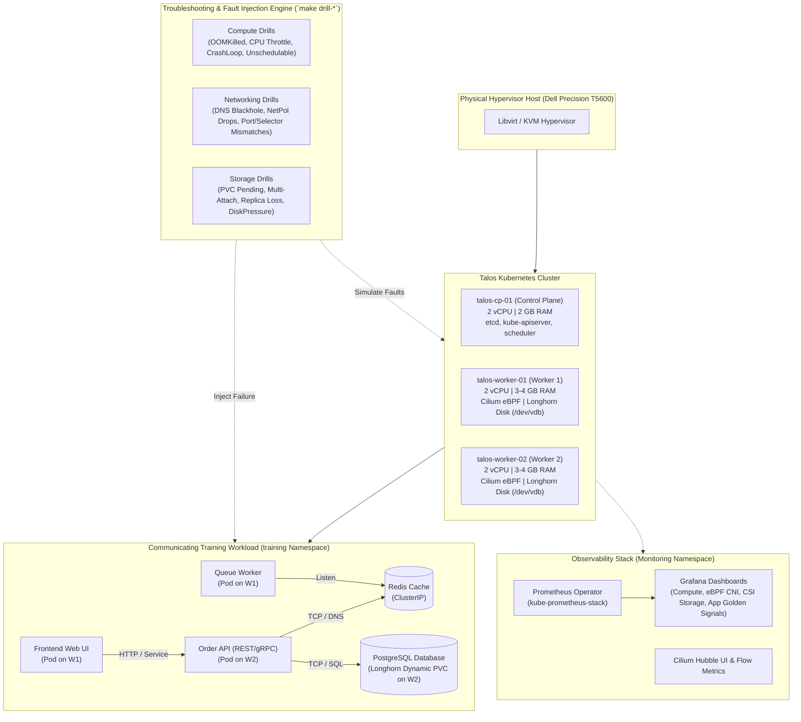
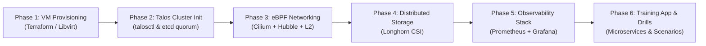

# Architecture Blueprint & Implementation Plan: Advanced Kubernetes Platform & Troubleshooting Lab

## Goal Description
Build an enterprise-grade, multi-node Kubernetes platform from the ground up on **Talos Linux** with **Cilium eBPF CNI**, **Longhorn Dynamic CSI**, and **ArgoCD GitOps**, purpose-built as an **interactive training and troubleshooting laboratory**.

This environment allows deep, hands-on learning of Kubernetes **Compute, Networking, Storage**, and **Observability** (Prometheus Operator, Grafana, Hubble UI), complete with automated fault injection scenarios and structured diagnostic runbooks.

---

## Lab Architecture & System Overview



---

## Target Technology Stack

| Layer | Technology | Key Capabilities & Learning Highlights |
| :--- | :--- | :--- |
| **Infrastructure / OS** | **Talos Linux + Libvirt/QEMU** | Declarative machine config, zero SSH attack surface, immutable rootfs, `talosctl` mTLS API & kernel inspection. |
| **Container Runtime & K8s** | **containerd + Upstream K8s v1.31+** | Native upstream control plane (`kube-apiserver`, `etcd`, `kube-controller-manager`, `kube-scheduler`). |
| **Networking & Security** | **Cilium CNI (eBPF)** | `kube-proxy` replacement, Layer 2 IP Announcement (LoadBalancer without MetalLB), Hubble flow visualizer, CiliumNetworkPolicies. |
| **Dynamic Storage (CSI)** | **Longhorn CSI** | Distributed block storage across workers, VolumeSnapshots, dynamic StorageClasses, ReadWriteOnce & ReadWriteMany volumes. |
| **Observability & Metrics** | **Prometheus + Grafana + Hubble** | Node/pod metrics, alert rules, Cilium eBPF packet drop graphs, Longhorn CSI latency/IOPS dashboards, Hubble service map. |
| **Continuous Delivery** | **ArgoCD (GitOps)** | Root App-of-Apps pattern, automated synchronization, drift detection, and declarative cluster add-ons. |
| **Training Workload** | **Multi-Tier Communicating Microservices** | Frontend $\leftrightarrow$ Backend API $\leftrightarrow$ Redis $\leftrightarrow$ Postgres with persistent Longhorn storage. |
| **Troubleshooting Engine** | **Drill Manager CLI (`scripts/drill_manager.py`)** | Interactive scenario injection, symptom verification, and automated cluster healing. |

---

## Troubleshooting Scenario Matrix

| Domain | Scenario ID | Injected Failure | Root Cause & Symptoms | Observability & Diagnostic Clues |
| :--- | :--- | :--- | :--- | :--- |
| **Compute** | `comp-oom-killed` | Memory leak in queue worker | Pod exits with code 137 (`OOMKilled`). | Grafana memory spike, `kubectl describe pod` Last State: OOMKilled. |
| **Compute** | `comp-cpu-throttling` | High CPU load with strict quota | Microservice latency spikes, p99 increases. | Grafana CPU throttling % graph, `kubectl top pod`. |
| **Compute** | `comp-crashloop` | Missing secret / invalid config | Pod stuck in `CrashLoopBackOff`. | `kubectl logs --previous`, `kubectl describe pod` events. |
| **Compute** | `comp-unschedulable` | Node affinity mismatch / overcommit | Pod remains in `Pending` state. | `kubectl get events`, `kubectl describe pod` 0/3 nodes available. |
| **Compute** | `comp-probe-fail` | Broken liveness/readiness probe path | Pod restarts repeatedly or 0 endpoints active. | `kubectl describe pod` probe HTTP 404, `kubectl get ep`. |
| **Network** | `net-dns-timeout` | CoreDNS disruption / bad upstream | API cannot resolve `database.training.svc`. | CoreDNS Grafana panel, `kubectl exec -it ... -- nslookup`, Hubble drops. |
| **Network** | `net-policy-block` | Restrictive CiliumNetworkPolicy | Frontend receives HTTP 504 / connection timeout. | Hubble UI red drop flows, `hubble observe --verdict DROPPED`. |
| **Network** | `net-port-mismatch` | Service `targetPort` misconfigured | Connection refused on Service ClusterIP. | `kubectl describe svc`, compare with container port spec. |
| **Network** | `net-service-endpoint` | Mismatched selector label on Service | `Endpoints` slice is `<none>`. | `kubectl get endpoints <svc>`, check deployment labels. |
| **Storage** | `stor-pvc-pending` | Invalid StorageClass or capacity | PVC stuck in `Pending`, Pod `ContainerCreating`. | `kubectl describe pvc`, `kubectl get sc`, CSI provisioner logs. |
| **Storage** | `stor-multi-attach` | RWO volume claimed on 2 nodes | `Multi-Attach error for volume ... already attached`. | `kubectl describe pod` events, Longhorn volume manager. |
| **Storage** | `stor-disk-pressure` | Synthetic disk fill on worker volume | Node enters `DiskPressure=True`, pod eviction. | `talosctl dmesg`, `talosctl disks`, Grafana disk pressure alert. |
| **Storage** | `stor-longhorn-degraded` | Worker node down / disk unmounted | Longhorn volume enters `Degraded` state. | Longhorn UI, Grafana Longhorn dashboard, rebuild metrics. |
| **Security/RBAC** | `ctrl-rbac-denied` | ServiceAccount missing RoleBinding | API calls return `403 Forbidden`. | Container logs, `kubectl auth can-i ... --as=system:serviceaccount:...`. |

---

## Project Structure

```
talos-k8s-platform/
├── Makefile                            # Top-level workflow & drill management automation
├── scripts/
│   ├── configure.py                    # Interactive setup & configuration wizard
│   ├── doctor.py                       # Pre-flight environment diagnostics
│   └── drill_manager.py                # Troubleshooting scenario injector & healer
├── terraform/
│   ├── modules/
│   │   ├── libvirt_talos_node/         # Reusable libvirt VM module for Talos
│   │   └── talos_cluster/              # Talos machine configs & bootstrap provider
│   └── environments/
│       ├── 00-sandbox-hypervisor/      # (Optional) L1 Sandbox VM if running nested
│       └── 01-talos-cluster/           # L1/L2 Talos Control Plane & Worker VMs
├── talos/
│   ├── talconfig.yaml                  # Declarative Talos cluster generator (talhelper)
│   ├── patches/                        # Machine config patches (Cilium, Longhorn storage disks)
│   └── talosconfig                     # Generated mTLS client config
├── gitops/
│   ├── bootstrap/
│   │   └── root-application.yaml       # ArgoCD Root App-of-Apps
│   ├── platform/
│   │   ├── cilium/                     # Helm values for Cilium CNI + Hubble + L2 Announcement
│   │   ├── longhorn/                   # StorageClass & CSI provisioner
│   │   └── monitoring/                 # Prometheus Operator, Grafana Dashboards & Alerts
│   └── apps/
│       └── training-app/               # Multi-tier communicating microservices (UI, API, Redis, DB)
└── docs/
    ├── 01-architecture.md
    ├── 02-bootstrap-guide.md
    └── troubleshooting-drills/         # Guided diagnostic and learning runbooks
        ├── README.md                   # 4-Stage Diagnostic Framework
        ├── 01-compute-drills.md        # Compute & Scheduling runbooks
        ├── 02-networking-drills.md     # eBPF, DNS & NetworkPolicy runbooks
        └── 03-storage-drills.md        # CSI, PVC & Longhorn storage runbooks
```

---

## Phased Implementation Roadmap



### Phase 1: Virtual Infrastructure & Talos Images
1. Create Terraform module for Talos VMs on libvirt.
2. Download and register the official Talos KVM image.
3. Define 1 Control Plane VM and 2 Worker VMs with dual virtual disks (OS + Longhorn storage).

### Phase 2: Cluster Generation & Bootstrapping
1. Generate machine configurations with `talosctl gen config` with `kube-proxy` disabled.
2. Apply machine configs via `talosctl apply-config` over mTLS.
3. Bootstrap etcd via `talosctl bootstrap`.
4. Fetch admin `kubeconfig` and verify node registration (`kubectl get nodes`).

### Phase 3: Cilium eBPF Networking & Hubble
1. Deploy Cilium with `kubeProxyReplacement: true`, Hubble UI, flow metrics, and L2 announcements.
2. Verify cross-node pod connectivity with `cilium connectivity test`.

### Phase 4: Longhorn Distributed Block Storage
1. Deploy Longhorn CSI utilizing worker data disks (`/dev/vdb`).
2. Validate dynamic PVC provisioning, volume replication, and snapshot capabilities.

### Phase 5: Observability Stack (Prometheus & Grafana)
1. Deploy `kube-prometheus-stack` with pre-configured scraping for Node Exporter, Kubelet, Cilium eBPF, and Longhorn.
2. Install curated Grafana dashboards for cluster compute, networking drops, storage latency, and application golden signals.

### Phase 6: Communicating Workload & Troubleshooting Drills
1. Deploy the multi-tier communicating training application (`frontend`, `order-api`, `cache`, `database`).
2. Integrate `drill_manager.py` with the drill scenario catalog.
3. Provide step-by-step diagnostic runbooks in `docs/troubleshooting-drills/`.
