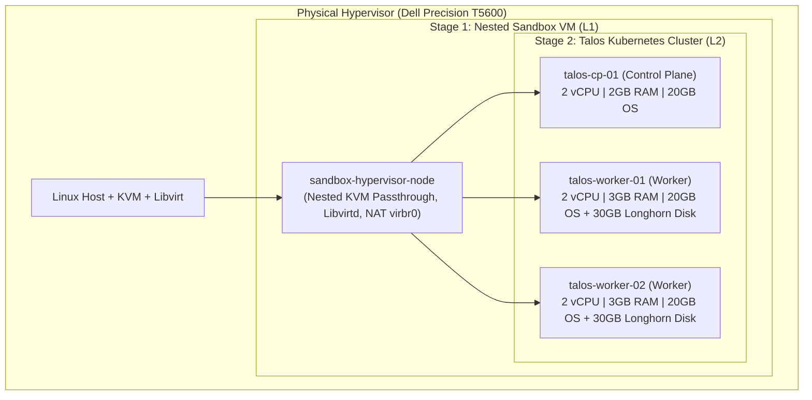

# Talos Kubernetes Platform on Nested Libvirt / KVM

[](#)
[](#)
[](#)
[](#)

> [!WARNING]
> **Project Status: Alpha / Active Early Development**
> This repository is in its initial alpha development phase with minimal to initial testing. Architecture patterns, Terraform modules, and platform configurations are undergoing rapid development and subject to breaking changes. This repository is currently intended for experimentation, research, and homelab prototyping.

---

An enterprise-grade, immutable Kubernetes platform provisioned on local hypervisor infrastructure (Dell Precision T5600) using **Talos Linux**, **Cilium eBPF CNI**, **Longhorn Distributed Storage**, and **ArgoCD GitOps**.

---

## 🏛️ Architecture Overview

The platform uses a layered nested virtualization model to ensure complete isolation from the host OS while providing high-performance eBPF-driven networking and cloud-native storage:



---

## 🛠️ Technology Stack

| Layer | Component | Description |
| :--- | :--- | :--- |
| **Hypervisor** | **QEMU / KVM + Libvirt** | Hardware-accelerated nested virtualization. |
| **Node OS** | **Talos Linux (v1.8+)** | Immutable, minimal, API-driven Kubernetes OS (Zero SSH / Zero systemd). |
| **Container Engine** | **containerd + Upstream K8s (v1.31+)** | Upstream Kubernetes components with strict declarative configs. |
| **Networking (CNI)** | **Cilium eBPF** | `kube-proxy` replacement, Layer 2 Announce (LoadBalancer VIPs), Hubble flow observability. |
| **Storage (CSI)** | **Longhorn CSI** | Replicated distributed block storage for stateful workloads. |
| **GitOps** | **ArgoCD** | Root App-of-Apps repository pattern for continuous delivery. |
| **Secrets Engine** | **External Secrets Operator** | Secure secret distribution decoupled from source control. |

---

## 📂 Repository Structure

```
.
├── PLAN.md                             # Architectural Blueprint & Implementation Plan
├── DEVELOPMENT.md                      # Developer workflows, diagnostics, and quality gates
├── Makefile                            # Unified workflow automation
├── target.env.example                  # Deployment target environment template
├── scripts/
│   ├── configure.py                    # Target onboarding & verification wizard (make configure)
│   ├── doctor.py                       # Workstation developer tool diagnostics (make doctor)
│   ├── preflight_server.py             # Hypervisor preflight validator (make preflight)
│   ├── verify_stage1.py                # Automated Stage 1 sandbox hypervisor verification
│   └── verify_stage2.py                # Automated Stage 2 Talos VM cluster verification
├── terraform/
│   ├── modules/
│   │   └── libvirt_talos_node/         # Reusable Talos VM Libvirt module
│   └── environments/
│       ├── 01-nested-sandbox/          # Stage 1: L1 Nested Sandbox Hypervisor VM
│       └── 02-talos-cluster/           # Stage 2: L2 Downstream Talos Control Plane & Workers
├── talos/
│   ├── talconfig.yaml                  # Declarative cluster definition
│   └── patches/                        # Machine configuration patches (Cilium, Storage)
├── gitops/
│   ├── bootstrap/                      # ArgoCD Root Application
│   ├── platform/                       # Platform add-ons (Cilium, Longhorn, Cert-Manager)
│   └── apps/                           # Application workloads (CloudNativePG HA cluster)
└── docs/                               # Architecture and operational runbooks
```

---

## 🚀 Quick Start Guide

### 1. Workstation & Target Server Diagnostics

```bash
# 1. Audit your local workstation toolchain (Terraform, kubectl, talosctl, etc.)
make doctor

# 2. Configure and verify your target server credentials & storage pools
make configure

# 3. Run target hypervisor pre-flight checks (KVM, libvirtd, storage pools, bridges)
make preflight
```

### 2. Multi-Stage Deployment

```bash
# Provision Stage 1: Nested Sandbox Hypervisor (L1 VM)
make stage1-init
make stage1-apply
make verify-stage1

# Provision Stage 2: Downstream Talos Nodes (L2 VMs)
make stage2-init
make stage2-apply
make verify-stage2

# Bootstrap Talos OS Control Plane
make talos-gen-config
make talos-bootstrap
make talos-kubeconfig
make talos-health

# Deploy Platform Services
make cilium-install
make cilium-verify
make longhorn-install

# Bootstrap ArgoCD Continuous Delivery
make gitops-bootstrap
```

---

## 📖 Detailed Documentation
* **[Implementation Plan & Architecture](PLAN.md)**
* **[Developer & Workflow Guide](DEVELOPMENT.md)**
* **[Architecture Decision Records (ADRs)](docs/adr/)**
* **[Disaster Recovery & Failure Drills](docs/03-disaster-recovery-drills.md)**
