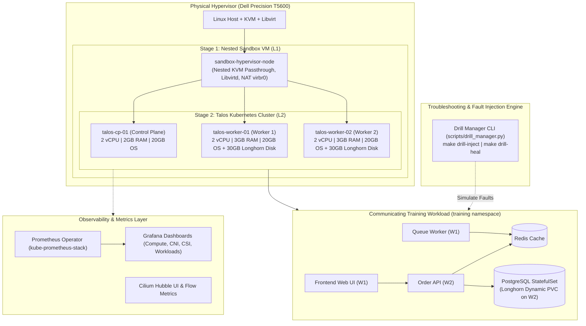

# Talos Kubernetes Platform & Troubleshooting Lab

[](#)
[](#)
[](#)
[](#)
[](#)
[](#)
[](#)

An enterprise-grade, immutable Kubernetes platform and **hands-on troubleshooting laboratory** built on local hypervisor infrastructure (Dell Precision T5600) using **Talos Linux**, **Cilium eBPF CNI**, **Longhorn Distributed Storage**, **Prometheus & Grafana**, and **ArgoCD GitOps**.

This lab provides deep learning and practical drills for diagnosing real-world Kubernetes issues across **Compute**, **Networking**, **Storage**, and **Security**.

---

## 🏛️ Architecture Overview



---

## 🚦 Milestone Roadmap & Status

| Milestone | Scope & Deliverables | Verification Suite | Status |
| :--- | :--- | :--- | :--- |
| **M1: Foundation & Virtualization** | Terraform modules for L1 Sandbox Hypervisor and L2 Talos VMs | `make test-m1` | ✅ **Complete & Merged** |
| **M2: Talos OS & Bootstrapping** | Machine configs, Cilium/storage patches, etcd quorum, `talosctl` | `make test-m2` | ✅ **Complete & Merged** |
| **M3: Networking & Storage** | Cilium eBPF, Hubble UI, L2 Announcements, Longhorn CSI | `make test-m3` | ✅ **Complete & Merged** |
| **M4: GitOps & Workloads** | ArgoCD App-of-Apps, External Secrets, CloudNativePG, Training App | `make test-m4` | ✅ **Complete & Merged** |
| **M5: Troubleshooting Drills & Lab** | Fault injection CLI, 4-phase diagnostic runbooks, DR drills | `make drill-list` | ⏳ **In Progress** |
| **M6: Observability Platform** | `kube-prometheus-stack`, Prometheus Operator, Grafana Dashboards | `make monitoring-install` | ⏳ **In Progress** |

---

## 🧪 Interactive Troubleshooting & Failure Drills

The environment features a dedicated **Fault Injection CLI** (`scripts/drill_manager.py`) and step-by-step diagnostic runbooks in [`docs/troubleshooting-drills/`](docs/troubleshooting-drills/README.md).

```bash
# 1. View all available troubleshooting drills
make drill-list

# 2. Inject a realistic failure (e.g. Memory leak, eBPF drop, Port mismatch, Pending PVC)
make drill-inject SCENARIO=comp-oom-killed

# 3. Observe live symptoms across kubectl, Grafana, and Hubble
make drill-verify SCENARIO=comp-oom-killed

# 4. Restore the cluster to a healthy state
make drill-heal SCENARIO=comp-oom-killed
```

### Scenario Catalog Summary:
- **Compute:** OOMKilled (`comp-oom-killed`), CPU Quota Throttling (`comp-cpu-throttling`), Unschedulable Pods (`comp-unschedulable`), Probe Failures (`comp-probe-fail`).
- **Networking:** CiliumNetworkPolicy Drops (`net-policy-block`), TargetPort Mismatch (`net-port-mismatch`), Service Selector Mismatch (`net-service-endpoint`).
- **Storage:** Unsatisfied StorageClass / Pending PVC (`stor-pvc-pending`), Multi-Attach Lock (`stor-multi-attach`), Longhorn Replica Degradation (`stor-longhorn-degraded`).

---

## 📊 Observability & Telemetry

- **Cilium Hubble Flow Visualizer:** Real-time socket-level packet tracking and dependency graphs.
  ```bash
  make hubble-ui       # Reachable at http://localhost:12000
  ```
- **Prometheus & Grafana:** Pre-packaged dashboards for Compute pressure, Cilium eBPF drops, and Longhorn CSI latency.
  ```bash
  make monitoring-install
  make grafana         # Reachable at http://localhost:3000 (admin / prom-operator)
  ```

---

## 🚀 Quick Start & Daily Lifecycle

```bash
# 1. Audit developer workstation prerequisites
make doctor

# 2. Onboard and verify target server (Dell T5600)
make configure
make preflight

# 3. Provision Infrastructure (Stages 1 & 2)
make stage1-apply && make verify-stage1
make stage2-apply && make verify-stage2

# 4. Generate Machine Configs & Bootstrap Talos Control Plane
make talos-gen-config
make talos-apply-config
make talos-bootstrap
make talos-kubeconfig
make talos-health

# 5. Deploy Networking & Dynamic Storage
make cilium-install
make longhorn-install

# 6. Deploy Training Microservices & Observability
make workload-install
make monitoring-install
```

---

## 📖 Documentation Directory

* **[Architecture Blueprint & Implementation Plan](PLAN.md)**
* **[Developer Workflow & Testing Guide](DEVELOPMENT.md)**
* **[Troubleshooting Drills & Diagnostic Framework](docs/troubleshooting-drills/README.md)**
  * [01. Compute & Scheduling Runbooks](docs/troubleshooting-drills/01-compute-drills.md)
  * [02. Networking & eBPF Runbooks](docs/troubleshooting-drills/02-networking-drills.md)
  * [03. Storage & CSI Runbooks](docs/troubleshooting-drills/03-storage-drills.md)
* **[Architecture Decision Records (ADRs)](docs/adr/)**
