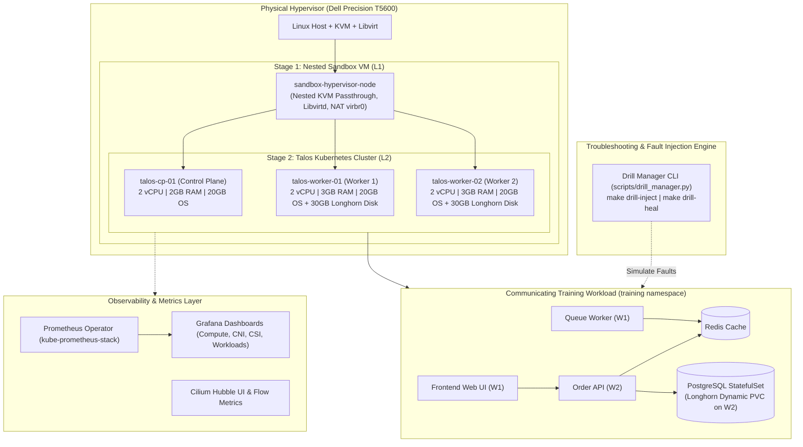

# Talos Kubernetes Platform & Troubleshooting Lab

[-blue.svg)](#)
[](#)
[](#)
[](#)
[](#)
[](#)
[](#)

An enterprise-grade, immutable Kubernetes platform and **hands-on troubleshooting laboratory** built on local hypervisor infrastructure (Dell Precision T5600) using **Talos Linux**, **Cilium eBPF CNI**, **Longhorn Distributed Storage**, **Prometheus & Grafana**, and **ArgoCD GitOps**.

This lab provides deep learning and practical drills for diagnosing real-world Kubernetes issues across **Compute**, **Networking**, **Storage**, and **Security**.

---

## 🏛️ Architecture Overview



---

## 🚦 Milestone Roadmap & Status

All project milestones (M1–M6) are fully implemented and undergoing active verification.

| Milestone | Scope & Deliverables | Verification Suite | Status |
| :--- | :--- | :--- | :--- |
| **M1: Foundation & Virtualization** | Terraform modules for L1 Sandbox Hypervisor and L2 Talos VMs | `make test-m1` | ✅ **Complete & Verified** |
| **M2: Talos OS & Bootstrapping** | Machine configs, Cilium/storage patches, etcd quorum, `talosctl` | `make test-m2` | ✅ **Complete & Verified** |
| **M3: Networking & Storage** | Cilium eBPF, Hubble UI, L2 Announcements, Longhorn CSI | `make test-m3` | ✅ **Complete & Verified** |
| **M4: GitOps & Workloads** | ArgoCD App-of-Apps, External Secrets, CloudNativePG, Training App | `make test-m4` | ✅ **Complete & Verified** |
| **M5: Troubleshooting Drills & Lab** | Fault injection CLI, 4-phase diagnostic runbooks, DR drills | `make test-m5` | ✅ **Complete & Verified** |
| **M6: Observability Platform** | `kube-prometheus-stack`, Prometheus Operator, Grafana Dashboards | `make test-m6` | ✅ **Complete & Verified** |

---

## 🚀 Quick Start: Standing Up the Cluster

Follow the complete stand-up procedure detailed in the [Cluster Bootstrap & Learning Guide](docs/02-bootstrap-guide.md):

```bash
# 1. Audit developer workstation prerequisites
make doctor

# 2. Configure target deployment server (Dell T5600)
make configure
make preflight

# 3. Provision Infrastructure (Stages 1 & 2)
make stage1-apply && make verify-stage1
make stage2-apply && make verify-stage2

# 4. Generate Machine Configs & Bootstrap Talos Control Plane
make talos-gen-config
make talos-apply-config
make talos-bootstrap
make talos-kubeconfig
make talos-health
make verify-stage3

# 5. Deploy Networking (Cilium eBPF) & Dynamic Storage (Longhorn)
make cilium-install
make longhorn-install
make verify-stage4

# 6. Deploy Training Microservices & Observability Stack
make workload-install
make monitoring-install
make verify-stage5
make verify-stage6
```

---

## 📊 Accessing Observability & Visual Dashboards

| Tool | Access Command | Local URL | Credentials |
| :--- | :--- | :--- | :--- |
| **Grafana** | `make grafana` | `http://localhost:3000` | `admin` / `prom-operator` |
| **Hubble UI** | `make hubble-ui` | `http://localhost:12000` | No auth (local) |
| **Longhorn UI** | `kubectl port-forward -n longhorn-system svc/longhorn-frontend 8080:80` | `http://localhost:8080` | No auth (local) |

---

## 🧪 Interactive Troubleshooting & Failure Drills

The environment features a dedicated **Fault Injection CLI** (`scripts/drill_manager.py`) and step-by-step diagnostic runbooks in [`docs/troubleshooting-drills/`](docs/troubleshooting-drills/README.md).

```bash
# 1. View all available troubleshooting drills
make drill-list

# 2. Inject a realistic failure (e.g. Memory leak, eBPF drop, Port mismatch, Pending PVC)
make drill-inject SCENARIO=comp-oom-killed

# 3. Observe live symptoms across kubectl, Grafana, and Hubble
make drill-verify SCENARIO=comp-oom-killed

# 4. Restore the cluster to a healthy state
make drill-heal SCENARIO=comp-oom-killed
```

### Scenario Catalog Summary:
- **Compute:** OOMKilled (`comp-oom-killed`), CPU Quota Throttling (`comp-cpu-throttling`), Unschedulable Pods (`comp-unschedulable`), Probe Failures (`comp-probe-fail`).
- **Networking:** CiliumNetworkPolicy Drops (`net-policy-block`), TargetPort Mismatch (`net-port-mismatch`), Service Selector Mismatch (`net-service-endpoint`).
- **Storage:** Unsatisfied StorageClass / Pending PVC (`stor-pvc-pending`), Multi-Attach Lock (`stor-multi-attach`), Longhorn Replica Degradation (`stor-longhorn-degraded`).

---

## 📖 Complete Documentation Index

| Guide / Document | Description |
| :--- | :--- |
| **[Architecture & Design Guide](docs/01-architecture.md)** | Deep dive into nested virtualization, eBPF routing, Longhorn storage, and telemetry pipelines. |
| **[Cluster Bootstrap & Stand-up Guide](docs/02-bootstrap-guide.md)** | Step-by-step walkthrough to stand up the cluster from zero, verify health, and access tools. |
| **[Troubleshooting Framework & Drills](docs/troubleshooting-drills/README.md)** | The 4-Phase Diagnostic Framework (`Detect -> Isolate -> Root Cause -> Remediate`). |
| ├── **[01. Compute & Scheduling Runbooks](docs/troubleshooting-drills/01-compute-drills.md)** | Runbooks for OOMKilled, CPU Throttling, Unschedulable pods, and probe failures. |
| ├── **[02. Networking & eBPF Runbooks](docs/troubleshooting-drills/02-networking-drills.md)** | Runbooks for CoreDNS outages, Cilium policy drops, and port/selector mismatches. |
| └── **[03. Storage & CSI Runbooks](docs/troubleshooting-drills/03-storage-drills.md)** | Runbooks for pending PVCs, multi-attach locks, and replica degradation. |
| **[Disaster Recovery & Node Drain Drills](docs/03-disaster-recovery-drills.md)** | Operational drills for live worker drain/eviction, Talos reboot, and CSI VolumeSnapshot recovery. |
| **[Architecture Decision Records (ADRs)](docs/adr/)** | Formal decision records (ADR 001–008) detailing technical trade-offs and rationale. |
| **[Developer & Workflow Guide](DEVELOPMENT.md)** | Pre-commit hooks, linting standards, and multi-stage testing automation. |
| **[Architecture Blueprint](PLAN.md)** | Comprehensive platform architecture blueprint and component specifications. |
