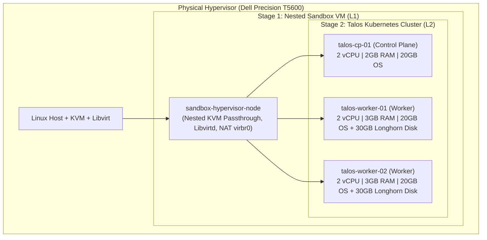

# Talos Kubernetes Platform on Nested Libvirt / KVM

An enterprise-grade, immutable Kubernetes platform provisioned on local hypervisor infrastructure (Dell Precision T5600) using **Talos Linux**, **Cilium eBPF CNI**, **Longhorn Distributed Storage**, and **ArgoCD GitOps**.

---

## 🏛️ Architecture Overview

The platform uses a layered nested virtualization model to ensure complete isolation from the host OS while providing high-performance eBPF-driven networking and cloud-native storage:



---

## 🛠️ Technology Stack

| Layer | Component | Description |
| :--- | :--- | :--- |
| **Hypervisor** | **QEMU / KVM + Libvirt** | Hardware-accelerated nested virtualization. |
| **Node OS** | **Talos Linux (v1.8+)** | Immutable, minimal, API-driven Kubernetes OS (Zero SSH / Zero systemd). |
| **Container Engine** | **containerd + Upstream K8s (v1.31+)** | Upstream Kubernetes components with strict declarative configs. |
| **Networking (CNI)** | **Cilium eBPF** | `kube-proxy` replacement, Layer 2 Announce (LoadBalancer VIPs), Hubble flow observability. |
| **Storage (CSI)** | **Longhorn CSI** | Replicated distributed block storage for stateful workloads. |
| **GitOps** | **ArgoCD** | Root App-of-Apps repository pattern for continuous delivery. |
| **Secrets Engine** | **External Secrets Operator** | Secure secret distribution decoupled from source control. |

---

## 📂 Repository Structure

```
.
├── PLAN.md                             # Architectural Blueprint & Implementation Plan
├── Makefile                            # Unified workflow automation
├── terraform/
│   ├── modules/
│   │   └── libvirt_talos_node/         # Reusable Talos VM Libvirt module
│   └── environments/
│       ├── 01-nested-sandbox/          # Stage 1: L1 Nested Sandbox Hypervisor VM
│       └── 02-talos-cluster/           # Stage 2: L2 Downstream Talos Control Plane & Workers
├── talos/
│   ├── talconfig.yaml                  # Declarative cluster definition
│   └── patches/                        # Machine configuration patches (Cilium, Storage)
├── gitops/
│   ├── bootstrap/                      # ArgoCD Root Application
│   ├── platform/                       # Platform add-ons (Cilium, Longhorn, Cert-Manager)
│   └── apps/                           # Application workloads (CloudNativePG HA cluster)
└── docs/                               # Architecture and operational runbooks
```

---

## 🚀 Quick Start Guide

### Prerequisites
Ensure your local workstation has the required control tools installed:
- `terraform` / `tofu` ($\ge$ 1.5.0)
- `talosctl` ($\ge$ 1.8.0)
- `kubectl` ($\ge$ 1.30.0)
- `helm` ($\ge$ 3.14.0)

### Deployment Stages

```bash
# 1. Provision Stage 1: Nested Sandbox Hypervisor
make stage1-init
make stage1-apply

# 2. Provision Stage 2: Talos Control Plane & Worker VMs
make stage2-init
make stage2-apply

# 3. Bootstrap Talos Cluster & Extract Kubeconfig
make talos-bootstrap
make talos-kubeconfig

# 4. Deploy Cilium CNI (eBPF)
make cilium-install
make cilium-verify

# 5. Bootstrap ArgoCD GitOps
make gitops-bootstrap
```

---

## 📖 Detailed Documentation
* **[Implementation Plan & Architecture](PLAN.md)**
* **[Disaster Recovery & Failure Drills](docs/03-disaster-recovery-drills.md)**
