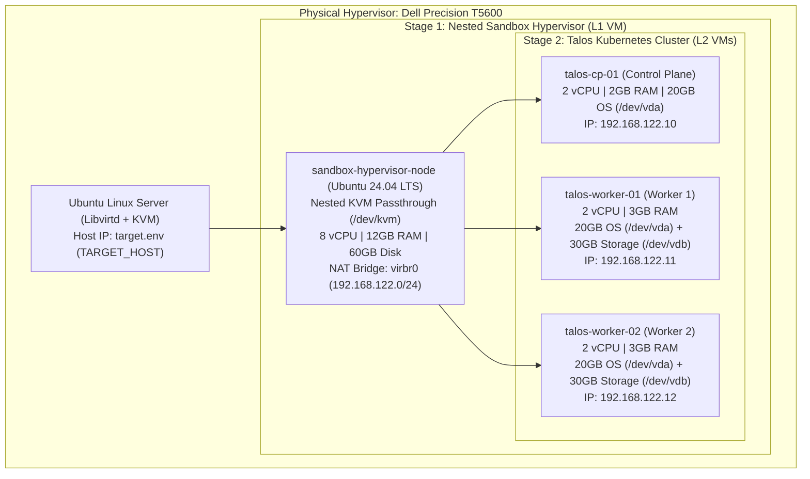
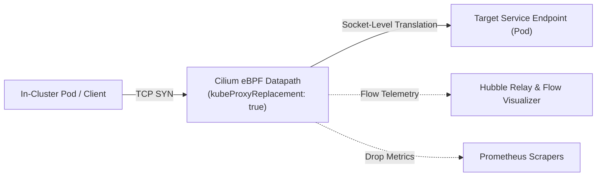
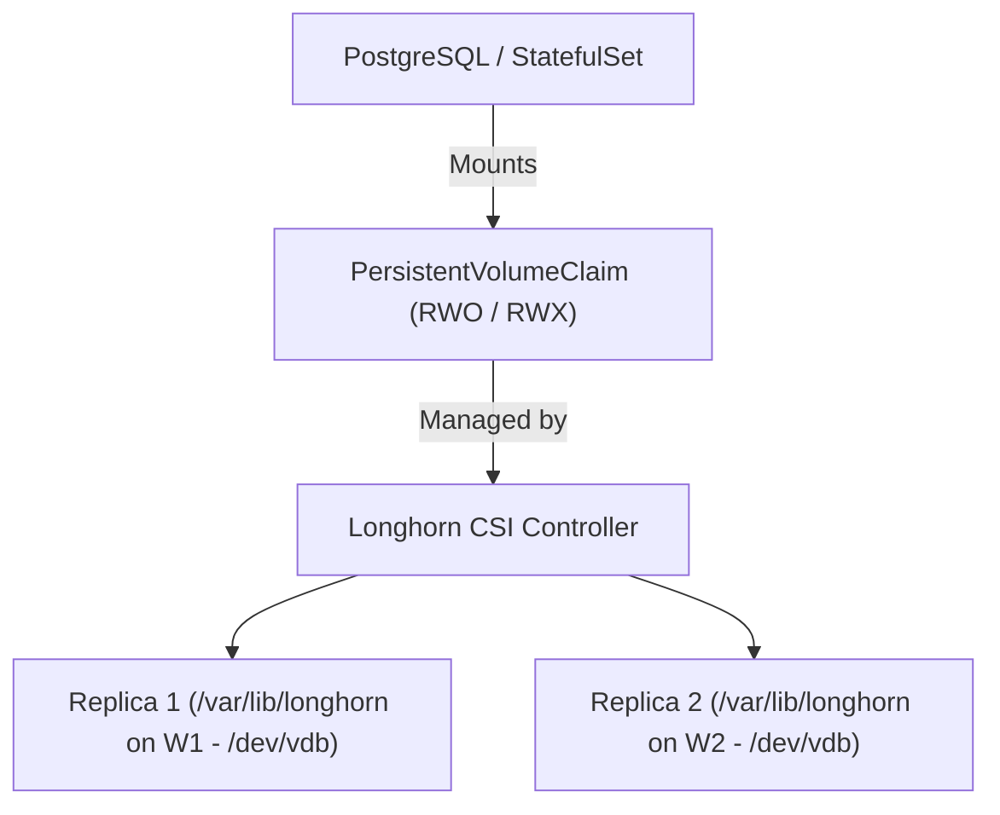
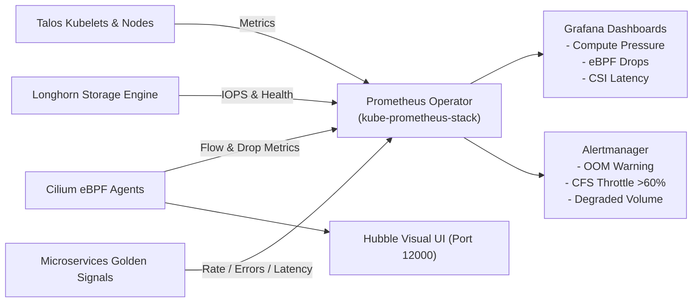

# Platform Architecture & Design Guide

This document describes the technical architecture, nested virtualization topology, network routing, distributed storage mechanics, and telemetry pipeline of the **Talos Kubernetes Platform & Troubleshooting Laboratory**.

---

## 1. Physical & Nested Virtualization Topology

The platform operates on a Dell Precision T5600 bare-metal server using KVM hardware virtualization:

### Key Architectural Benefits
- **Complete Host Isolation:** All Kubernetes nodes live inside the destroyable `sandbox-hypervisor-node` VM, preventing pollution of the physical hypervisor.
- **Zero SSH / Immutable OS:** Talos Linux eliminates shell access, package managers, and systemd in favor of declarative YAML configuration managed over an mTLS API on port `50000`.

---

## 2. eBPF Networking & Service Routing (Cilium CNI)

Cilium replaces standard `kube-proxy` and iptables with high-performance eBPF datapaths:

### Highlights
- **Direct Server Return (DSR) & Socket Load Balancing:** Eliminates extra network hops and preserves client source IPs.
- **Layer 2 IP Announcements:** Hosts LoadBalancer virtual IPs on the local network (`192.168.122.200/29`) without needing MetalLB.
- **Hubble Flow Visibility:** Inspects every socket-level connection, packet drop, DNS lookup, and HTTP latency in real-time.

---

## 3. Dynamic Distributed Block Storage (Longhorn CSI)

Longhorn provides resilient, replicated persistent volumes across worker nodes using dedicated virtual disks:

- **Replication:** Each dynamic volume is mirrored synchronously across `talos-worker-01` and `talos-worker-02`.
- **Automatic Self-Healing:** If a worker node is drained or detached, Longhorn marks the volume as `Degraded` and triggers automated rebuilding upon node reconnection.
- **VolumeSnapshots:** Integration with CSI `VolumeSnapshotClass` enables instant point-in-time backups and recovery.

---

## 4. Observability & Telemetry Pipeline

