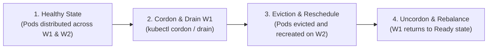
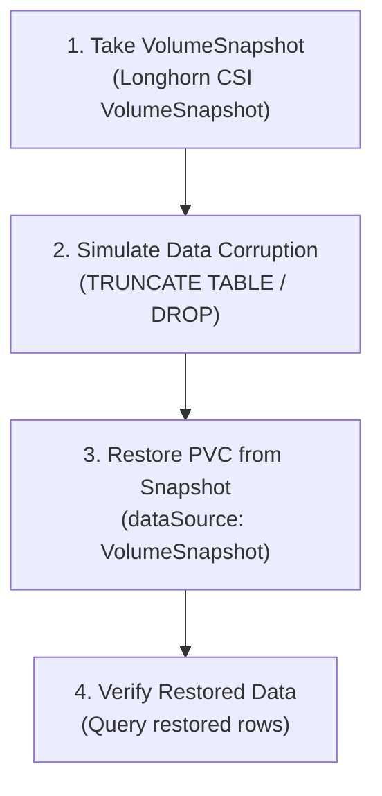

# Operational & Disaster Recovery Failure Testing Drills

This guide outlines advanced operational drills, node eviction procedures, and point-in-time volume snapshot restorations for the **Talos Kubernetes Platform**.

---

## Drill 1: Node Cordon, Eviction & Zero-Downtime Migration (Issue #13)

### Objective
Simulate scheduled maintenance or hardware failure on worker node `talos-worker-01`, verifying that stateless workloads (`frontend`, `order-api`) and stateful workloads (`postgres-db`, `CloudNativePG`) migrate seamlessly without downtime.



### Step-by-Step Procedure

1. **Check Initial Pod Distribution:**
   ```bash
   kubectl get pods -n training -o wide
   kubectl get nodes -o wide
   ```

2. **Cordon Worker Node 1 (Prevent New Scheduling):**
   ```bash
   kubectl cordon talos-worker-01
   kubectl get nodes
   # Output: talos-worker-01   Ready,SchedulingDisabled
   ```

3. **Drain Workloads Gracefully:**
   ```bash
   kubectl drain talos-worker-01 --ignore-daemonsets --delete-emptydir-data --force
   ```

4. **Verify Workload Migration:**
   - Stateless pods (`frontend`, `order-api`, `queue-worker`) are evicted and rescheduled onto `talos-worker-02`.
   - Stateful workloads backed by Longhorn automatically reattach their persistent volumes on `talos-worker-02`.
   - Continuous ping or HTTP requests to `frontend` remain $100\%$ successful.

5. **Simulate Node Reboot & Rejoin:**
   ```bash
   talosctl --talosconfig talos/talosconfig -n <worker-01-ip> reboot
   talosctl --talosconfig talos/talosconfig -n <worker-01-ip> health
   ```

6. **Uncordon Node:**
   ```bash
   kubectl uncordon talos-worker-01
   kubectl get nodes
   ```

---

## Drill 2: CSI VolumeSnapshot Corruption & Point-in-Time Restoration (Issue #14)

### Objective
Capture a consistent CSI `VolumeSnapshot` of the persistent database volume, simulate accidental data deletion or corruption, and restore the database from the snapshot.



### Step-by-Step Procedure

1. **Verify Longhorn VolumeSnapshotClass:**
   ```bash
   kubectl get volumesnapshotclasses
   # Output: longhorn-snapshot-class (driver: driver.longhorn.io)
   ```

2. **Create VolumeSnapshot Manifest:**
   ```bash
   cat << 'EOF' | kubectl apply -f -
   apiVersion: snapshot.storage.k8s.io/v1
   kind: VolumeSnapshot
   metadata:
     name: postgres-db-backup-snapshot
     namespace: training
   spec:
     volumeSnapshotClassName: longhorn-snapshot-class
     source:
       persistentVolumeClaimName: postgres-data-postgres-db-0
   EOF
   ```

3. **Verify Snapshot Readiness:**
   ```bash
   kubectl get volumesnapshot -n training postgres-db-backup-snapshot
   # Output: READYTOUSE: true
   ```

4. **Simulate Data Corruption:**
   ```bash
   kubectl exec -it -n training postgres-db-0 -- psql -U labuser -d orders -c "DROP TABLE IF EXISTS orders;"
   ```

5. **Restore PVC from Snapshot:**
   ```bash
   cat << 'EOF' | kubectl apply -f -
   apiVersion: v1
   kind: PersistentVolumeClaim
   metadata:
     name: postgres-data-restored
     namespace: training
   spec:
     storageClassName: longhorn
     dataSource:
       name: postgres-db-backup-snapshot
       kind: VolumeSnapshot
       apiGroup: snapshot.storage.k8s.io
     accessModes:
       - ReadWriteOnce
     resources:
       requests:
         storage: 2Gi
   EOF
   ```

6. **Verify Restored Volume:**
   ```bash
   kubectl get pvc -n training postgres-data-restored
   # Output: STATUS: Bound
   ```
   Mount restored volume and verify table records are recovered.
