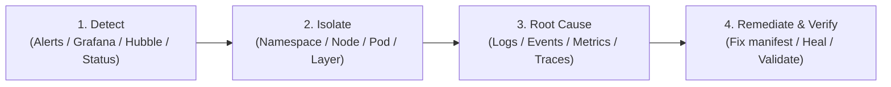

# Kubernetes Troubleshooting & Diagnostic Framework

Welcome to the **Kubernetes Troubleshooting Laboratory**. This guide defines the structured, four-phase diagnostic framework used to investigate, root cause, and resolve cluster and application failures.

---

## The 4-Phase Diagnostic Protocol

When an alert fires in Grafana, Hubble traces indicate drops, or pods enter an unhealthy state, systematically apply the **Detect $\to$ Isolate $\to$ Root Cause $\to$ Remediate** protocol:



### Phase 1: Detect (Symptoms & Entry Points)
* **Grafana Dashboards**: Review Compute/Node pressure, CoreDNS latency, Cilium packet drops, or Longhorn replica health.
* **Hubble UI / CLI**: Inspect dropped flows, DNS lookup failures, or HTTP 5xx responses (`hubble observe --verdict DROPPED`).
* **Cluster Overview**: `kubectl get pods -A -o wide` to spot any pods in `CrashLoopBackOff`, `OOMKilled`, `Pending`, or `Error`.

### Phase 2: Isolate (Triaging the Domain)
Categorize the failure into one of the four foundational domains:
1. **Compute / Workload**: Is the container failing to run, exceeding memory/CPU limits, or failing probes?
2. **Networking / CNI / DNS**: Can the pod resolve DNS names? Is traffic being dropped by a NetworkPolicy or port mismatch?
3. **Storage / CSI**: Is the PVC stuck in `Pending`? Is a volume attachment locked across nodes? Are Longhorn replicas degraded?
4. **Control Plane / Security**: Is etcd or apiserver unresponsive? Is an RBAC RoleBinding missing?

### Phase 3: Root Cause (Deep Inspection)
* **Kubernetes Control Plane State**: `kubectl describe pod <name>`, `kubectl get events --sort-by=.metadata.creationTimestamp`.
* **Application Logs**: `kubectl logs <pod> [-c <container>] [--previous]`.
* **Kernel & Node OS (Talos)**: `talosctl logs -n <node> kubelet`, `talosctl dmesg -n <node>`, `talosctl disks -n <node>`.
* **eBPF Tracing**: `cilium monitor --type drop`, `hubble observe --from-pod <pod>`.

### Phase 4: Remediate & Verify
* Apply the declarative fix (edit manifest or patch Kubernetes resource).
* Verify state: Pod transitions to `Running` ($1/1$), endpoints populate, Grafana error rates drop to zero, and Hubble shows `FORWARDED` flows.

---

## Lab Drill Commands (`make drill-*`)

The platform includes a drill manager CLI (`scripts/drill_manager.py`) to inject and heal scenarios:

```bash
# List all available troubleshooting drills
make drill-list

# Inject a specific failure scenario
make drill-inject SCENARIO=comp-oom-killed

# Verify current symptoms of an active scenario
make drill-verify SCENARIO=comp-oom-killed

# Restore the cluster to a healthy state
make drill-heal SCENARIO=comp-oom-killed
```

---

## Drill Catalog & Runbooks

- [01. Compute & Scheduling Drills](file:///home/bjarrett/Projects/talos-k8s-platform/docs/troubleshooting-drills/01-compute-drills.md) (OOMKilled, CPU Throttling, CrashLoop, Unschedulable, Probe Failures)
- [02. Networking & eBPF Drills](file:///home/bjarrett/Projects/talos-k8s-platform/docs/troubleshooting-drills/02-networking-drills.md) (DNS Outages, CiliumNetworkPolicy Drops, TargetPort Mismatches, Empty EndpointSlices)
- [03. Storage & CSI Drills](file:///home/bjarrett/Projects/talos-k8s-platform/docs/troubleshooting-drills/03-storage-drills.md) (Pending PVCs, Multi-Attach Errors, Disk Pressure, Longhorn Replica Degradation)
